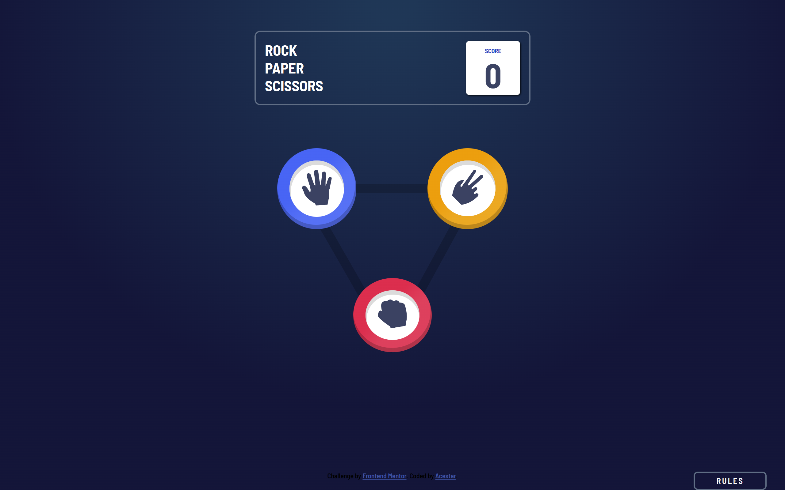

# Frontend Mentor - Rock, Paper, Scissors solution

This is a solution to the [Rock, Paper, Scissors challenge on Frontend Mentor](https://www.frontendmentor.io/challenges/rock-paper-scissors-game-pTgwgvgH). Frontend Mentor challenges help you improve your coding skills by building realistic projects. 

## Table of contents

- [Overview](#overview)
  - [The challenge](#the-challenge)
  - [Screenshot](#screenshot)
  - [Links](#links)
- [My process](#my-process)
  - [Built with](#built-with)
  - [What I learned](#what-i-learned)
  - [Continued development](#continued-development)
  - [Useful resources](#useful-resources)
- [Author](#author)

## Overview

### The challenge

Users should be able to:

- View the optimal layout for the game depending on their device's screen size
- Play Rock, Paper, Scissors against the computer
- Maintain the state of the score after refreshing the browser _(optional)_

### Screenshot



### Links

- Solution URL: [Add solution URL here](https://your-solution-url.com)
- Live Site URL: [Add live site URL here](https://your-live-site-url.com)

## My process

### Built with

- Semantic HTML5 markup
- CSS custom properties
- CSS Flexbox
- jQuery
- Desktop-first workflow

### What I learned

I finissed how to better use flexbox for webpage layout. I also refreshed using jQuery for Javascript. Most importantly, I learnt how to store data to the local storage of the browser.

To see how you can add code snippets, see below:

```js
var storage = window.localStorage;
$(".score p").html(storage.getItem('score'));
```

### Continued development

I would consider upgrading it to Rock, Paper, Scissors, Lizard and Sprock.

### Useful resources

- [ChatGPT](https://chat.openai.com) - It helped me in understanding the local storage concept as well helped me revise jQuery.

## Author

- Frontend Mentor - [@Acestar](https://www.frontendmentor.io/profile/Acestar)
- Twitter - [@IsaacOniti](https://www.twitter.com/IsaacOniti)
